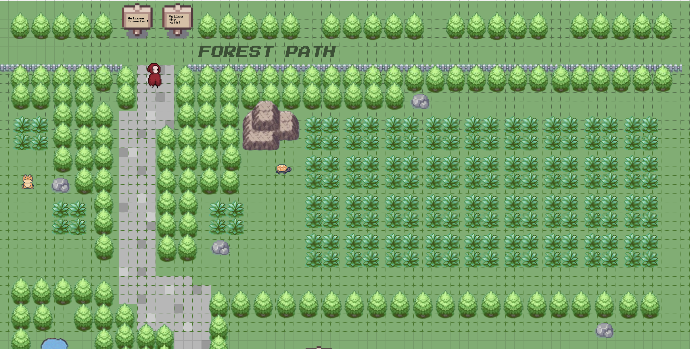
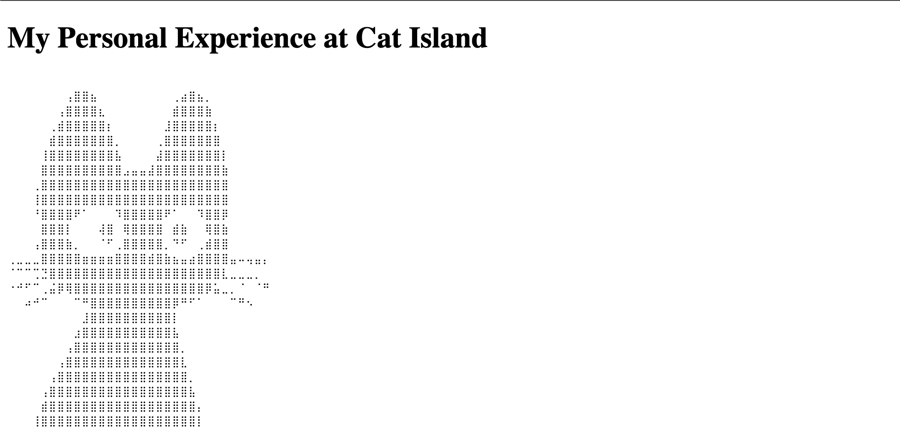
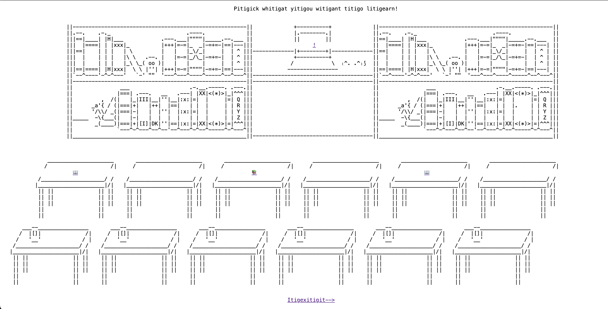
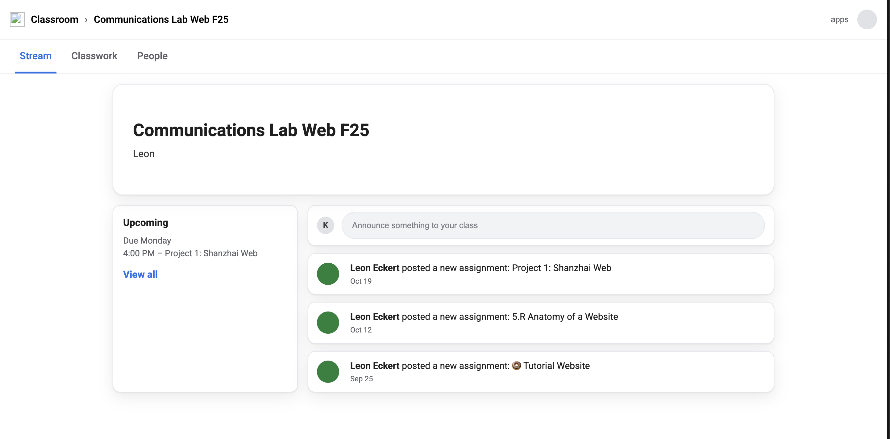

# Katerina's CommLab Page 

Sit back and relax!

TAKE A LOOK AT MY PROJECTS BELOW :)  

[A Journey Through Sheets](https://docs.google.com/spreadsheets/d/1uMxK4m3RUekNRAEj6n6Xtvfbx1L4TEM7nt6dU-fiAcw/edit?gid=0#gid=0)

A quiet journey through different biomes made using Google Sheets! Take time to decompress as you scroll and click around the landscape. 

* [Life Story as Scroll](https://karaki-maker.github.io/CommLab/cat-island)

A diary about my experience at Shanghai's Cat Island! Please be kind. It was my first website ever so it was extremely simple and purely made to document cute kitties and show the sanctuary some love. (But please go visit Cat Island!)

* [Tutorial Website](https://karaki-maker.github.io/CommLab/tutorial)

A nonsensical website using Gibberish (a made up language that is actually functional!) Join your cat guide in a journey to teach you the language as you walk around its world. 

* [Shanzai Web](https://karaki-maker.github.io/CommLab/google-classroom-2/)

A twist on everyone's favorite educational platform: Google Classroom! Feel the stress of homework pile on you as you procrastinate to get anything done! 

