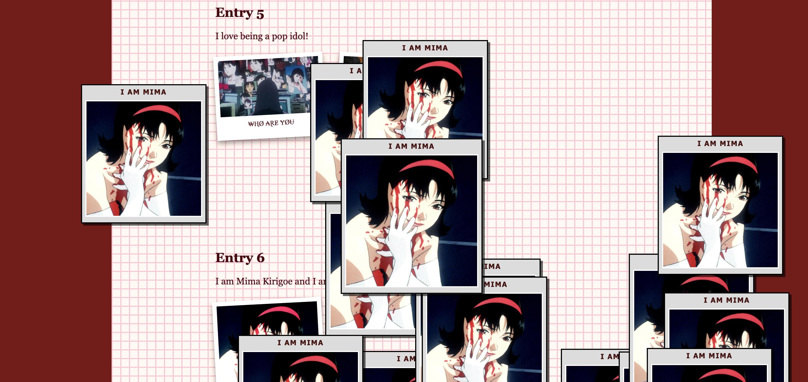
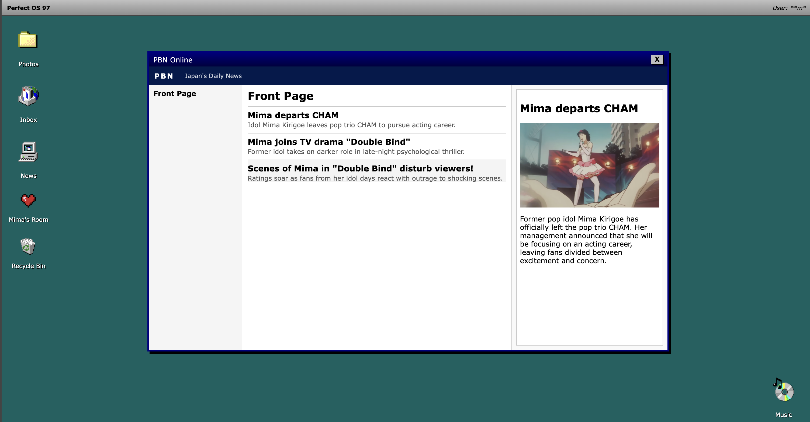
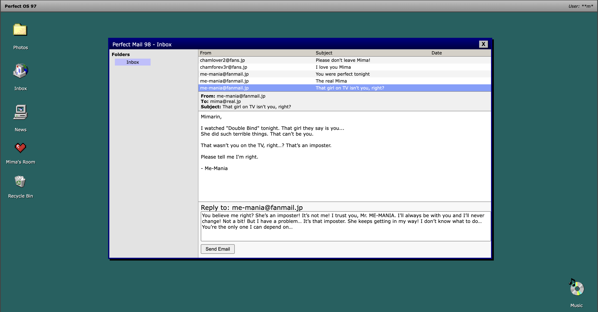

# 🌀 Perfect Blue: Online - A Nonlinear Exploration of Perfect Blue 
**By Katerina Araki**

 *Landing Page* 

**Perfect Blue: Online** is an interactive website created for the *Communications Lab* course as part of the **Adapted for the Web Project**. This website functionas as web adaption of Satoshi Kon's *Perfect Blue* (1997) that follows the struggles of Mima, a Japanese pop idol recently turned actress as she learns the difficulties of her new identity. Explore a new perspective of the film as you navigate a desktop with content relating to Mima, figuring out clues to this digital reality along the way. 

**Perfect Blue: Online** adapts the psychological horror film in a nonlinear web experience that mirrors the instability of the original protagonist's identity. The project drops the viewers into a mysterious blog titled, "Mima's Room" and explores the identity of Mima as her image as a former Japanese pop idol, actress, private self, and online presence all begin to collapse into each other. Rather than telling theh film linearly, thr story is translated into the medium of the web through an interactive desktop interface filled with folders, pop-ups, and digital remnants the users must navigate. The website emphasizes feelings of disorientation, encouraging views to piece together meanign rather than provide explanation. The conclusion entirely depends on you! So viewers are invited to approach the work slowly, carefully, and with uncertainty. 

*News Page* 

*Email Inbox* 

I hope you all enjoy my last project for this course! I plan to develop the website further in the future to add more elements of the original story and make it more interactive!

See [this document](https://docs.google.com/document/d/1YIoAJT6c90_gte-IbqjOWCm6JCLdgPnbv2877Ye3oCk/edit?usp=sharing) for my web design process and reflection. 

