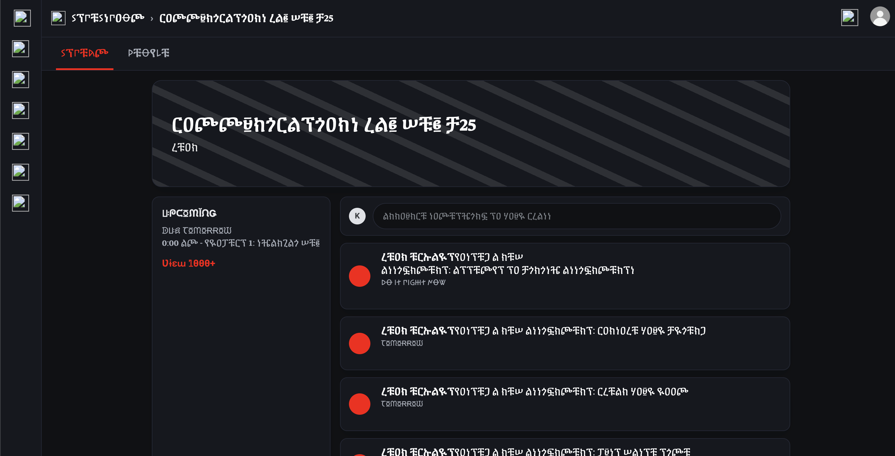

# 🌀 Stressroom

 

**Stressroom** is an interactive website created for the *Communications Lab* course as part of the **Shanzhai Project**.  

It explores the modern experience of procrastination, stress, and productivity, reflecting how easy it is to get distracted until the pressure of time becomes unavoidable.

In the digital age, work and leisure often blur together. **Stressroom** represents that tension. It is a space where users feel the urge to be productive but are constantly pulled toward procrastination.

The site intentionally simulates:
- The feeling of wasting time online while trying to focus  
- The rising anxiety of deadlines approaching  

##  Features
- 5+ webpages 
- 3 interactive "mini-games" 
- 2 different endings  

## Built With 
- HTML 
- CSS 

I hope you all enjoy this little project! I hope to add more interactive elements and design components in the future! 