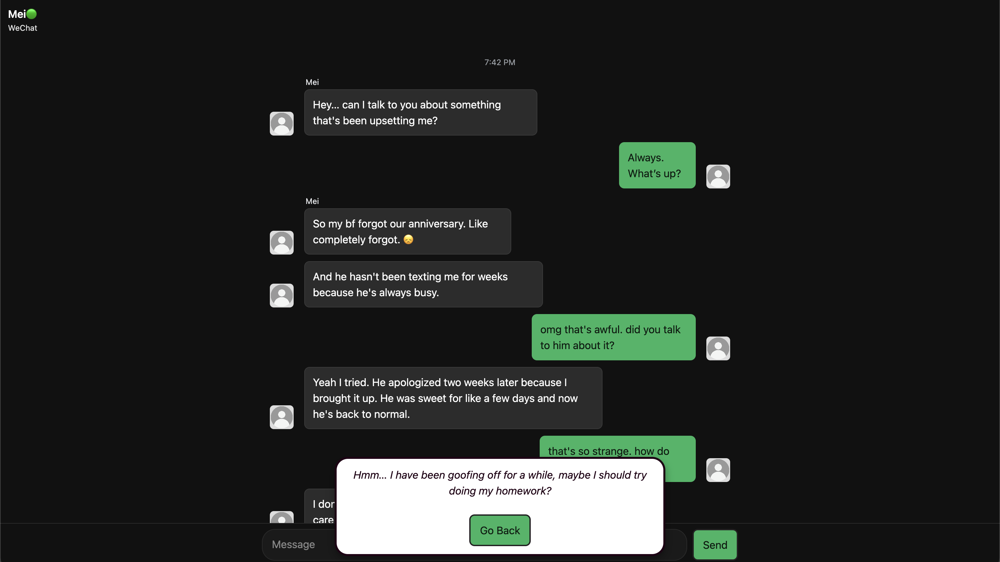
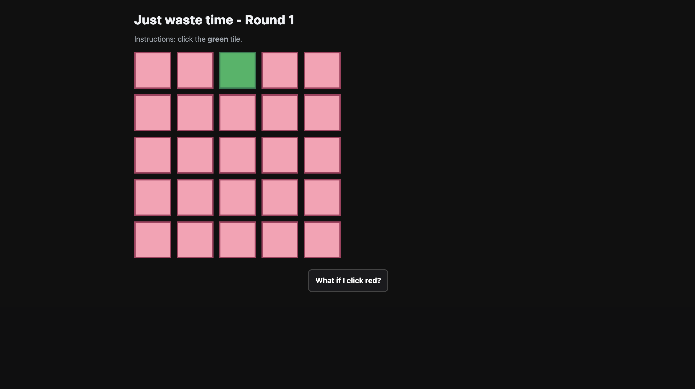

# 🌀 Stressroom: Google Classroom's Evil Cousin 

 
*Stressroom main page* 

**Stressroom** is an interactive website created for the *Communications Lab* course as part of the **Shanzhai Project**.  

Have you ever had the desire to do anything but your homework? Well, welcome to Stressroom: a darker twist on everyone’s favorite school website, Google Classroom! Will you attempt your homework or goof around? Come and find out! 

**Stressroom** is an interactive web experience that reimagines the familiar environment of Google Classroom as a space of anxiety, distraction, and digital chaos. It reflects the modern student’s internal conflict between productivity and procrastination in an age where work and leisure coexist within the same screen. Users navigate an uncanny version of the classroom interface while they are tempted by distractions, unnerving visuals, and humorous yet unsettling prompts, to explore how stress manifests online. The project transforms a typically structured, academic platform into a distorted mirror of our daily routines, where everything you do becomes a choice between focus and avoidance. By exaggerating the pressures of online learning and the endless cycle of avoidance and guilt, **Stressroom** invites participants to confront their own habits and relationship with technology. It’s not about finishing your homework, but about realizing why you haven’t.

*Mini Game 1: Console Your Friend* 

*Mini Game 3: Just Waste Time* 

I hope you all enjoy this little project! I hope to add more interactive elements and design components in the future! 

See [this document](https://docs.google.com/document/d/1BYtGcwwCts1LWWttQop1bOKBodvam_2_HQGXkqIsKAg/edit?usp=sharing) for my web design process and reflection. 

